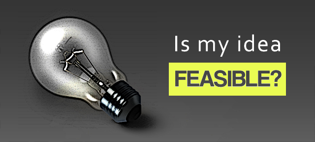
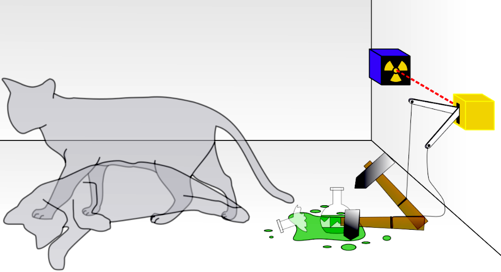

# Junior Seminar (CS580) Assignment 06

Feasibility: How do-able is my project?

**Assigned** : Tuesday 14th March 2023

**Due** : Tuesday 21st March 2023

## Objectives

* To determine some of the parameters which are necessary to complete a technical project. 
* To explore the available resources at hand (i.e., tools, skills, literature, data, and etc.) which will be applied to the completing of the project. 
* To inquire whether a project can be completed in a given time frame (2-3 months) with the application of the available tools.
* To realize that completing a project requires  strategizing (like playing the popular video game, [Tetris](https://tetris.com/play-tetris)!)

__Figure 1__: Is your idea feasible for the time and resources which are available to you?

## Introduction

An project idea may look wonderful on paper but when the time comes to complete the work, the reality of the project may not seem so optimistic. In order to prevent a project from having a false-start where the project begins, but does not end, it is highly recommended that time be spend to explore the facets and details of the projects to determine possible pitfalls. For example, when embarking on a large project where many different resources are to come together for its completion, the researcher is advised to consider what these resources are and how much of them will be necessary for a successful conclusion to the project.

### Resources and related questions come as shown below.

* __Hardware__: Do I have the correct equipment to run this project?
* __Skills__: Can I find a way to manipulate software /hardware? Can I write the necessary code? Can I install the necessary software and /or libraries that I will need? Can I connect these pieces as necessary for the project?
* __Tools__: What software, libraries, and similar do I need?
* __Data__: What data will I need? Where will I obtain my data? How much can I obtain? How
much should I use?
* __Time__: How long should this project take? How long will each part of my project take to complete?
* __Results__: What do successful results look like?
* __Analysis__: How will I analyze the results? What approach to use in my analysis?
* Other abilities and resources: What else do I need for this project? Is there anything else that I may need to use or implement at some point to make this project successful?

To find direction in light of the above concerns, one may simply to complete the project and then report back on what was necessary for the task. In this case, we are not actually completing the project, but rather we are completing a thought experiment where the project is the deliverable of the experiment.

## A Thought Experiment

Thought experiments are devices of the imagination which are employed for testing or exploration in various fields, such as, entertainment, education, conceptual analysis, exploration, hypothesizing, theory selection, theory implementation, and many others. Outlined at WikiPedia [https://en.wikipedia.org/](https://en.wikipedia.org/), a thought experiment is a hypothetical situation (i.e, an imaginary experiment) in which a hypothesis, theory, or principle may has been laid-out for the purpose of thinking through its consequences (and allowing for types of basic testing). These experiments are not necessary completed in the real world, but the knowledge can still be gathered from them when used in some analytical sense.

Discussed in Figure 2, a well-known thought experiment comes from a torturous experiment involving a cat by Schrödinger. In his work, Schrödinger outlines a hypothetical experiment to determine the health-state of a cat in a system, given various types of inputs and dangers including poison and radioactivity. To avoid committing severe animal cruelty in the name of his research, Schrödinger was able to gain some understanding by using only his imagination to manipulate the parameters of what would have proven to be a very dangerous experiment.

__Figure 2__: Schrödinger’s cat: a cat, a flask of poison, and a radioactive source are placed in a sealed box. If an internal monitor (e.g. Geiger counter) detects radioactivity (i.e. a single atom decaying), the flask is shattered, releasing the poison, which kills the cat. The Copenhagen interpretation of quantum mechanics implies that, after a while, the cat is simultaneously alive and dead. Yet, when one looks in the box, one sees that the cat is either alive __or__ dead. This poses the question of when exactly quantum superposition ends and reality resolves into one possibility or the other. Source: [Wikipedia](https://en.wikipedia.org/wiki/Schr%C3%B6dinger%27s_cat).

### Design

In a thought experiment, the outcome may be unclear, however, the setup of the experiment is actually quite defined. For instance, the necessary elements of Schrödinger’s work –- the radioactive instruments, the poison, the cat, in addition to all the other elements, were clearly placed in the experiment with well-defined roles.

When designing a thought experiment for research, an investigator is invited to carefully __consider all of the elements which would be necessary to gain knowledge__ or results. During this time, the investigator is also given opportunities to realize (or discover) _what_ else may be missing from the general experimental design. Missing entities may take the form of taking additional steps, adding more equipment, address faults in methodology, deeper analysis, or similar elements. In designing a thought experiment of the work, the investigator soon realizes some of the deeper aspects of the work to address for a project in _reality_.

## Feasibility Study

Once all the pieces and steps of the work have been assembled in one’s imagination for a thought experiment, their roles are (by this point) arguably more clearly defined. In addition, the details of timing – when each element is to be applied – are likely better understood. If the investigator feels that all the elements can be obtained and that the timing is convenient, then planning a real experiment may begin as it is thought to be feasible, meaning that it can be terminated successfully. Project feasibility is the determination of the do-ability of a project. It must be said here that feasible projects may still fail but that the likeliness of success is higher when the project is entirely feasible.

### Part 1, This Class (Tuesday): What To Do

File : `writing/reflection.md`

By this time, you have already determined the idea of your research project, as well as the necessities that you will need to obtain for the completion of the work. You have also identified the knowledge gap between your research questions and your general field. At this stage, you are to be thinking about the scope and feasibility of your project so as to be able to complete the work during a particular amount of available time.

For this part, you are to design a __thought experiment__ of the work and then answer some leading questions about the steps that are taken to complete the work. You will introduce and describe the individual elements and resources which are a part of your work. For this work, imagine that you are actually doing the work and that you are simply recording the details as they are completed.

Please follow the deliverable in your work repository for leading questions for this part.

### Part 2, Next Class (Thursday): the great interview

File : `writing/interview.md`

During Thursday's class, you will interview a colleague to whom you will ask searching questions to determine feasibility about his or her project. For instance, you will ask questions concerning the structure, timing resources and similar to determine potential pitfalls. When you have completed interviewing your partner, they will interview you in a similar way. 

You are to record your notes from this conversation to be able to update your web notebook and to respond to questions in your writing deliverable. Any feedback or advice you can offer your partner is to be placed in the issue tracker of their project.

### Part 3, Lab on Thursday, Class time on the following Tuesday

We will begin presentations where we will discuss the following general considerations for feasibility of our projects.

* What resources do you need to complete the project?
* How can you access these resources? 
* What could (__likely__) stand in the way of the completion of the project and how would you handle this bottleneck?

---

## Summary of Deliverables

* Complete your Markdown documents (`writing/reflection.md` and `writing/interview.md`).
* Prepare and give a three (3) minute lightning talk for Next Thursday's class for a checkmark participation point.
* Update research notebook with notes from your conversation about the feasibility of your project.

## Project Assessment

The grade that a student receives on this assignment will have the following components.

- **GitHub Actions CI Build Status [up to 10%]:**: For the repository associated with this assignment students will receive a checkmark grade if their last before-the-deadline build passes. This is only checking some baseline writing and commit requirements as well as correct running of the program. An additional reduction will given if the commit log shows a cluster of commits at the end clearly used just to pass this requirement. An addition reduction will also be given if there is no commit during lab work times. All other requirements are evaluated manually.

- **Mastery of Technical Writing [up to 60%]:**: Students will also receive a checkmark grade when the responses to the writing questions presented in the `reflection.md` reveal a proficiency of both writing skills and technical knowledge. To receive a checkmark grade, the submitted writing should have correct spelling, grammar, and punctuation in addition to following the rules of Markdown and providing conceptually and technically accurate answers.

- **Presentation [up to 30%]:**
Students will receive a checkmark grade for presentations. Student must be present to receive credit for presentation.

## GatorGrade

You can check the baseline writing and commit requirements for this lab assignment by running department's assignment checking `gatorgrade` tool. To use `gatorgrade`, you first need to make sure you have Python3 installed (type `python --version` to check). If you do not have Python installed, please see:

- [Setting Up Python on Windows](https://realpython.com/lessons/python-windows-setup/)
- [Python 3 Installation and Setup Guide](https://realpython.com/installing-python/)
- [How to Install Python 3 and Set Up a Local Programming Environment on Windows 10](https://www.digitalocean.com/community/tutorials/how-to-install-python-3-and-set-up-a-local-programming-environment-on-windows-10)

Then, if you have not done so already, you need to install `gatorgrade`:

- First, [install `pipx`](https://pypa.github.io/pipx/installation/)
- Then, install `gatorgrade` with `pipx install gatorgrade`

Finally, you can run `gatorgrade`:

`gatorgrade --config config/gatorgrade.yml`

## Seeking Assistance

* Extra resources for using markdown include;
  + [Markdown Tidbits](https://www.youtube.com/watch?v=cdJEUAy5IyA)
  + [Markdown Cheatsheet](https://github.com/adam-p/markdown-here/wiki/Markdown-Cheatsheet)
* Do not forget to use the above git commands to push your work to the cloud for the instructor to grade your assignment. You can go to your GitHub repository using your browser to verify that your files have been submitted. Please see the TL’s or the instructor if you have any questions about assignment submission.

Students who have questions about this project outside of the lab time are invited
to ask them in the course's Discord channel or during instructor's or TL's office hours.
